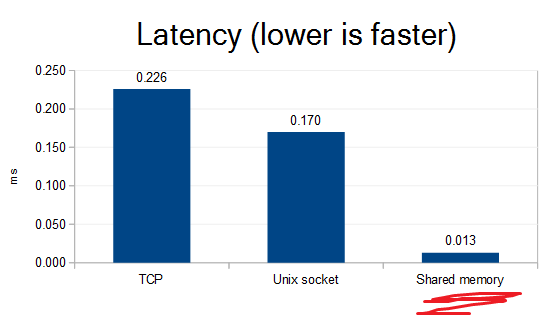

# Shared memory support for Redis



When your client is on the **same host as redis-server**, you can get much better latency than going through the TCP stack. And surely you want the **best latency you can get**. Redis folk know this - that's why unix socket support exists. But you can do a lot better with shared memory! There is some cost though - see the more at [#Performance](#performance) section below.

# Summary and usage

Redis module for shared memory client-server communication.

### Compilation

Server side:
```
git clone https://github.com/edgarsi/redis-module-shm.git
cd redis-module-shm
git clone https://github.com/antirez/redis.git
REDIS_INCLUDE_DIR=./redis/src/ make
```
This creates `module-shm-preload.so` and `module-shm.so` files.

Client side:
```
git clone https://github.com/edgarsi/hiredis-shm.git
cd hiredis-shm
make
```
This creates `libhiredis.so`. It contains the normal Hiredis functionality plus the ability to communicate through shared memory.

### Usage

Server side: `LD_PRELOAD=module-shm-preload.so redis-server --loadmodule module-shm.so`

In production, I really recommend running a higher priority than default (see [#Performance](#performance)):
`sudo nice -n -15 sudo -u myredisuser LD_PRELOAD=module-shm-preload.so redis-server --loadmodule module-shm.so`

Client side: It's all the same as the Hiredis you're used to using, with a few extra functions. See: [API and examples](https://github.com/edgarsi/hiredis-shm/blob/shared-memory/shm-api.md).

### Do I need a low latency?

Yeah! Well, could be, will be, likely so...

Synchronous communication makes for some cool guarantees. A synchronous messaging system can guarantee that a software crash may only lose the last packet attempted to be sent, *never* more. 13ms latency means you can get ~75000 syncronous commands per second through to Redis. Evaluate your requirements, and look at those numbers add up! :D

Say, you've already written a system which uses synchronous communication with Redis, but now some requirements have changed, a large client appeared or whatever, and you're running out of CPU. It could be as bad as large parts of the system may need rewriting. A proper system rewrite may take a few days, but you're out of CPU now. Just plug in that `module-shm.so` and you may not have to work on weekends on coffee power, and you may finish that rewrite properly.

### How does it work?

This code all relies on Linux, GCC and x86. I'm not even trying to investigate other platforms or compilers, as each is like a unicorn in this field - amazingly unique, complex, sometimes entwined in mysterious behaviours. Linux & GCC & x86 is the most popular combo.
* Linux shared memory - makes the communication possible. There are 2 FIFOs - one for each direction of communication. They are circular buffers of chars, nothing more.
* GCC atomics - allows avoiding relatively heavy synchronization mechanisms. Forcing the compiler and CPU do things in order with [memory barriers](https://gcc.gnu.org/onlinedocs/gcc-4.4.0/gcc/Atomic-Builtins.html), and using [stdatomic](http://en.cppreference.com/w/c/atomic) to avoid partial memory write/read nastiness.
* GCC volatile - avoids optimization dropping "unneeded" reads/writes. GCC sanely assumes no outsider is able to modify the memory the code accesses, but the shared memory does exactly that. Using `volatile` drops the GCC assumption.
* ~~mfence/clflush - avoids waiting for shared memory writes to move out of L1. (An alernative could be a [userspace DMA](https://github.com/ikwzm/udmabuf)?)~~ <- Nah, the default behaviour seems good enough and even slightly faster than clflush. Data moves out of L1 quickly. Calling clflush however forces data to be moved up to the main memory, a slow and often unnecessary task. 

Whenever a TCP or socket `read()`/`write()` would be called, a pop/push on the circular buffer is done instead.

A single dedicated thread on redis-server is actively reading the shared memory, waiting for input, or waiting for the buffer to free up for output. It never sleeps, and uses 100% of the CPU core, whenever at least one client is connected. Similarily, the Redis client uses 100% of its CPU core during any Redis API call. It's a chosen tradeof to avoid communicating through kernel, thus keeping latency extremely low. There is a gotcha though. When CPU load is high, the CPU scheduler gives bursts of CPU time, causing high latency during downtimes. As load gets higher, the duration and time between (=latency) the bursts gets higher. To avoid this latency, redis-server and client should be run with higher priority than other processes. Note that the same problem does not affect TCP or unix socket communication [iff](https://en.wikipedia.org/wiki/If_and_only_if) Redis requests are made with relatively large gaps between them. When a request occurs, the "waiting for sockets" Redis server (and client, if it was also sleeping) is woken up almost immediately because it hasn't used up any recent CPU time yet. I may implement configurable alternatives later...

Now, the nasty part. Redis modules aren't expected to change how connections work, or to create new custom connections. There is no API exposing that functionality. Instead, I call undocumented functions, and overwrite functions such as `read()` and `write()` with versions able to deal with shared memory connections. This overwriting is why the `LD_PRELOAD=module-shm-preload.so` part is needed. The alternative would be copy-pasting Redis server code and hijacking the main thread - ugly and unmaintainable. Overwriting libc functions is like a crossing a border out of North Korea - you're not supposed to, but the alternative is horrid.

The TCP or Unix socket connection is still necessary. It is used to exchange the info about the shared memory. When a new shared memory connection is established, a `SHM.OPEN` Redis module command is used to send the shared memory file name through the socket. No more information is exchanged through the socket after that, until the connection needs to be broken down.

### Performance

Well, the barchart above pretty much describes it. There are a few things to take attention for though:
* Your latency sensitive Redis server and client need to run with high CPU scheduler priority. See section [#How does it work?](#how-does-it-work) for the explanation why it's needed. A whole CPU thread will be 100% consumed to get that latency. It's always a single thread regardless of how many clients connected, if any.
* I made the test on a practically idle host. When the host is under load (`stress --cpu 50`), the latency of TCP and unix socket communication decreases... Yeah, I know. Under load, unix socket ping latency drops to 0.052ms. Several times higher than shared memory but an impressive drop nonetheless. But why it happens, I don't know. CPU power saving? Other folk have noticed this phenomena too and are [guessing it may be a scheduler thing](http://stackoverflow.com/questions/33950984/how-to-understand-redis-clis-result-vs-redis-benchmarks-result). You should really measure the latency on your own system and compare.

This is how the benchmark for the barchart is done (using [redis-shm](https://github.com/edgarsi/redis-shm) for an improved redis-cli):
<pre>

sudo nice -n -15 sudo -u edg ~/tmp/redis/src/redis-server --loadmodule ~/tmp/redis-module-shm/module-shm.so
03:08:54 edg@host ~/tmp/redis $ sudo taskset 0x01 nice -n -15 sudo -u edg ~/tmp/redis/src/redis-cli --latency
min: 0, max: 94, avg: 0.013 (878912 samples)^C

sudo nice -n -15 sudo -u edg ~/tmp/redis/src/redis-server
05:37:58 edg@host ~/tmp/redis $ sudo taskset 0x01 nice -n -15 sudo -u edg ~/tmp/redis/src/redis-cli --latency
min: 0, max: 70, avg: 0.226 (853519 samples)^C

sudo nice -n -15 sudo -u edg ~/tmp/redis/src/redis-server redis.conf # <- enabled unixsocket in conf
10:02:25 edg@host ~/tmp/redis $ sudo taskset 0x01 nice -n -15 sudo -u edg ~/tmp/redis/src/redis-cli -s redis.sock --latency
min: 0, max: 106, avg: 0.170 (1041387 samples)^C

</pre>

This fork of Redis has a redis-cli which supports shared memory communication. It also outputs millisecond latencies with 3 digits after comma, and has a new option `--latency-sample-rate`. Try `--latency-sample-rate 0` to see what happens when the communication channel is loaded at full capacity. I get three times lower latencies for sockets and for shared memory alike. 

If you compile this module, please make some tests and send in your results (as a new issue or email), for a little less bias.
How to compile and use:
```
git clone https://github.com/edgarsi/redis-shm.git
cd redis-shm
make
./src/redis-cli --latency-history
```

(Note that redis-benchmark won't use shared memory. It implements its own low level communication with the Redis server, bypassing the Hiredis code with shared memory support. But redis-cli doesn't do magic, so can be used for testing latency.)

